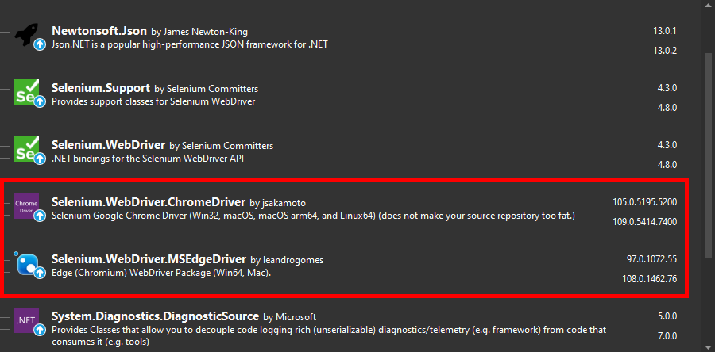

# Test Automation and EasyRepro: 06 - Updating Browser Dependencies

## Summary

In this article we will discuss monitoring execution timings and delivering these to Application Insights. We will look into the various timings within an execution, how to add tracing statements and finally to push events to Application Insights.

## Getting Started

If you haven't already, please review the previous articles on EasyRepro. This article assumes that the reader has this knowledge and will focus specifically on managing dependencies both locally and in CI/CD pipelines.

## Encountering the issue

In my experience, the browser dependency update is a very common issue that can impact both local and automated versions of UI Test Automation test suites. EasyRepro encounters this as well as it references the NuGet packages specifically by version, allowing teams to test against specific versions of browsers.

The error message you encounter may look like the following:
- ChromeDriver out of sync
- session not created: Chrome version must be between xx and xx
- A exception with a null response was thrown sending an HTTP request to the remote WebDriver server for URL

If you do run into any of the above, most likely you will need to update the **Microsoft.Dynamics365.UIAutomation.Sample** project's dependencies.

Above you can see highlighted both the Chrome and Edge Drivers. Using the NuGet packages this way will force developers to stay up to date with what version is on their machine. So if Chrome is 1xx, the driver version will need to match.

A helpful video describing the issue you'll run into is here. This video will help you diagnose and mitigate the dependency error:
!([EasyRepro - Troubleshooting - SessionNotCreated Exception](https://www.youtube.com/watch?v=bXCbx1gM6MM))

## Next Steps

### Managing Browser Dependencies in Microsoft or GitHub Agents

The example above shows how to address and troubleshoot NuGet packages locally as a developer. As you continue leveraging additional dependencies, consider the trade off between bringing your own or using what's available on the machine running your executable. This technique comes in handy specifically as we work with CI/CD agents.

Below is a video addressing this and showing how to stay agile by using the browser available on Microsoft and GitHub hosted agents.

https://www.youtube.com/watch?v=OOxboLnojMM

## Conclusion

In this article we have explored how to manage EasyRepro browser dependencies. Please reach out using YouTube comments or the repo for this and other testing articles.

