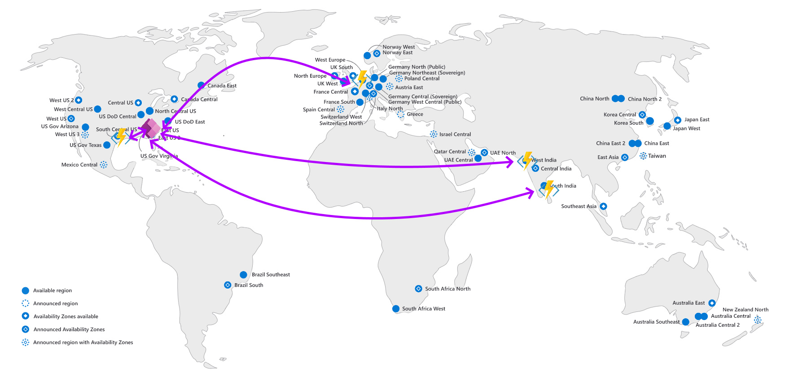

# Power Apps Testing - Automation the Execution of Power Apps Tests

## Overview

Continuous monitoring allows enterprises the opportunity to ensure reliable performant services are immediately available to its users. Platforms need to be able to keep up with demand in such a way that its seamless to a user. <u>Systems that become unreliable or unusable are quickly disregarded or abandoned</u>. One sure fire way to ensure uses won't use a service is if the service is unavailable. To account for this, enterprises looks to service level agreements and business continuity strategies. Part of this strategy includes testing for availability.

**Microsoft Power Apps** provide multiple tools to test and monitor application usage, from launching an app to navigating within an app. We will look into building a test strategy for **Microsoft Power Apps.** We will cover tools available, defining and building test, distinguishing tests versus actual usage telemetry and running automated tests.

## Building tests
For more information on building tests, please go to sections [Overview and Getting Started](01%20Power%20Apps%20Testing%20-%20Overview%20and%20Getting%20Started.md)

### Building and executing Test Studio tests
Test Studio, a tool that requires no ownership of code, we simply call a URL and analyze the response. Test Studio tests allow us to monitor when the test starts. [We can also add tracing statements.](https://learn.microsoft.com/en-us/power-apps/maker/canvas-apps/working-with-test-studio) --Note: This link contains a video showing how to use Power Apps Test Studio.

A challenge here traditionally has been how to automate this test. Historically, the tool to use has been UI Automation using the [PowerAppsTestAutomation open source project.](https://learn.microsoft.com/en-us/power-apps/maker/canvas-apps/test-studio-classic-pipeline-editor) This allows us to automate the tests within CI/CD pipelines but does require dependencies that need to be dealt with. For assistance on understanding browser dependencies and techniques to overcome these challenges, refer to my video:

[EasyRepro - DevOps - Managing Browser Dependencies in Microsoft or GitHub Agents](https://www.youtube.com/watch?v=OOxboLnojMM)

NOTE: While labeled for EasyRepro, starting around the 6 minute mark you can follow the same technique within your Microsoft hosted agents.

With the introduction of Power Apps Test Engine, we can run this Power Fx test in a test engine bypassing the URL.


### Building and executing Test Engine tests
Test Engine allows organizations to submit yaml based tests to an executable that will run the Power Fx based yaml tests against a Power App. Review the read me and samples to see how to build both the test engine and tests.

To execute locally, you can simply clone local, build the executable and run the test as a scheduled task. That approach does require periodic pulls from the source to update the source code, and recompilation. I would not recommend this approach unless there is a specific SecOps requirement to keep everything on-premise. If that requirement does exist the following approach should meet the requirements if using a self hosted agent.

The solution below meets our requirements of finding a tool that meets our requirements of being supported and maintained by Microsoft. The solution assumes no ownership of code and will pull each time the test suite is set to run.
The solution will remote checkout PowerApps-TestEngine, build the engine within the agent and run a test. If the test fails, it will fail the test workflow allowing for a badge to be presented upon completion. By enforcing instrumentation to the app we are testing, we are able to see the test run as shown below.


[The sample for this solution is located here.](https://github.com/aliyoussefi/TestingPowerPlatform/blob/main/.github/workflows/Clone-Build-Test.yml)

### Test Definition
```yml
testSuite:
  testSuiteName: Suite
  testSuiteDescription: Test Suite description
  persona: User1
  appLogicalName: ayw_canvasappdevelopmentworkshop_1d6fa
  appId: ''
  onTestCaseStart: |
    = 
    Trace("Test Case Started", TraceSeverity.Information, {
            TestStart: Text(Now())
        });
  onTestCaseComplete: |
    = 
    Trace("Test Case Complete", TraceSeverity.Information, {
             TestPass: TestCaseResult.TestCaseName & ":" & Text(Now())
             ,TestSuiteId: TestCaseResult.TestSuiteId
             ,TestSuiteName: TestCaseResult.TestSuiteName
             ,TestCaseId: TestCaseResult.TestCaseId
             ,TestCaseName: TestCaseResult.TestCaseName
             ,StartTime: TestCaseResult.StartTime
             ,EndTime: TestCaseResult.EndTime
             ,TestSuccess: TestCaseResult.Success
             ,TestTraces: JSON(TestCaseResult.Traces)
             ,TestFailureMessage: TestCaseResult.TestFailureMessage
    }
    );
  onTestSuiteComplete: |
    = 
    Trace("Test Suite Complete", TraceSeverity.Information, {
             TestSuiteId: TestSuiteResult.TestSuiteId
             ,TestSuiteName: TestSuiteResult.TestSuiteName
             ,StartTime: TestSuiteResult.StartTime
             ,EndTime: TestSuiteResult.EndTime
             ,TestPassCount: TestSuiteResult.TestsPassed
             ,TestFailCount: TestSuiteResult.TestsFailed
        }
    );
  networkRequestMocks: 
  testCases:
  - testCaseName: Availability Test
    testCaseDescription: ''
    testSteps: |
      = 
      Trace("App Launched");
testSettings:
  filePath: 
  browserConfigurations:
  - browser: Chromium
    device: 
    screenWidth: 0
    screenHeight: 0
  recordVideo: true
  headless: true
  enablePowerFxOverlay: false
  timeout: 30000
  workerCount: 10
environmentVariables:
  filePath: 
  users:
  - personaName: User1
    emailKey: user1Email
    passwordKey: user1Password

```

 Information on the test settings can be found on [the PowerApp-TestEngine repo.](https://github.com/microsoft/PowerApps-TestEngine/blob/main/docs/Yaml/test.md)
 Key call outs are the *locale* and *browser configurations* for **Test Settings**, *users* in **Environment Variables** and *test cases/steps* within the **Test Suite**.

### Testing Globally for Availability and Latency
In this example, we are looking to test availability from multiple spots worldwide. We are looking to test not only that Power Apps are opening up but how long it takes to open the app.

The below image shows that we will deploy to an App Service allowing for Azure Web Jobs or Azure Functions to execute the tests.


